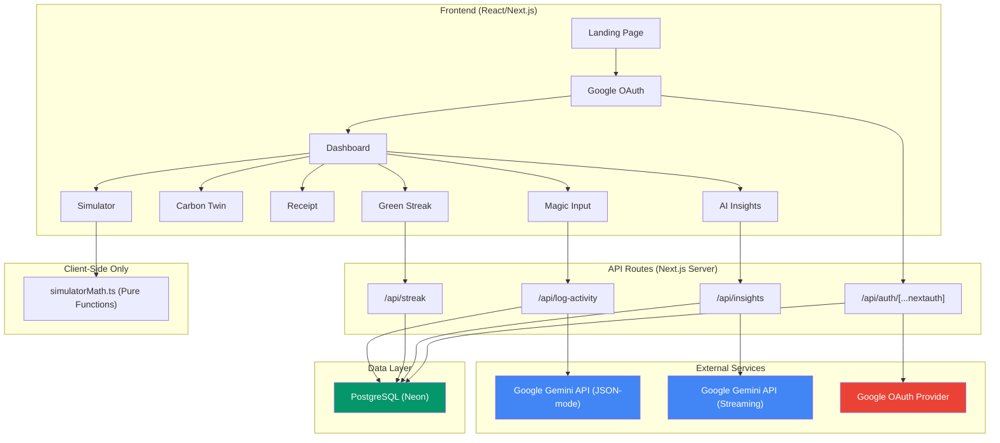

<p align="center">
  
</p>

<h1 align="center">🌿 Verda — Your AI Carbon Twin</h1>

<p align="center">
  <strong>Speak your day. See your impact. Live greener.</strong><br/>
  <em>The world's first voice-powered, AI-driven carbon footprint tracker — built for India's cities.</em>
</p>

<p align="center">
  <a href="https://verda-prompt-war-challenge-3.vercel.app"></a>
  
  
  
  
</p>

---

## 📌 Table of Contents

- [🎯 Chosen Vertical](#-chosen-vertical)
- [💡 Approach & Logic](#-approach--logic)
- [⚡ How the Solution Works](#-how-the-solution-works)
- [✨ Feature Deep-Dive (7 Core Features)](#-feature-deep-dive-7-core-features)
- [🏗️ Architecture & Data Flow](#️-architecture--data-flow)
- [🧮 Carbon Math & Formulas](#-carbon-math--formulas)
- [🔒 Security & Responsible AI](#-security--responsible-ai)
- [♿ Accessibility](#-accessibility)
- [🧪 Testing Strategy](#-testing-strategy)
- [⚙️ Run Locally](#️-run-locally)
- [📁 Project Structure](#-project-structure)
- [🌍 Environment Variables](#-environment-variables)
- [📊 Evaluation Criteria Mapping](#-evaluation-criteria-mapping)
- [⚠️ Assumptions Made](#️-assumptions-made)
- [🙏 Acknowledgements](#-acknowledgements)

---

## 🎯 Chosen Vertical

> **Sustainability & Climate Action**

Climate change is the defining challenge of our generation, but individual carbon tracking is broken — it's either too complex (spreadsheets, calculators) or too vague (generic tips). **Verda bridges this gap** by making carbon tracking as effortless as talking to a friend.

We chose this vertical because:
- 🇮🇳 India is the world's 3rd largest CO₂ emitter, but per-capita awareness tools are almost non-existent
- 🗣️ Voice-first input removes all friction — no forms, no dropdowns, no math
- 🤖 Gemini AI enables natural language understanding that was impossible just 2 years ago

---

## 💡 Approach & Logic

### The Problem
Traditional carbon calculators require users to manually enter structured data (km driven, kWh consumed, grams of food). This creates **high friction**, leading to abandonment rates above 80% within the first week.

### Our Insight
> *"What if tracking your carbon footprint was as easy as saying 'I drove 10km to work and had a chicken sandwich for lunch'?"*

### The Solution — Three Design Pillars

| Pillar | Implementation |
|--------|---------------|
| **🎤 Zero Friction** | Voice/text natural language input → Gemini AI parses → structured data saved automatically |
| **🌳 Emotional Feedback** | A living "Carbon Twin" tree that wilts or thrives based on your daily emissions — making abstract CO₂ numbers *feel* real |
| **🏙️ Local Context** | City-specific baselines (Delhi ≠ Bangalore) so comparisons are meaningful, not generic |

### Why This Works
Instead of asking users to do math, Verda **listens**, **calculates**, and **shows**. The entire flow from voice input to visual feedback takes under 3 seconds.

---

## ⚡ How the Solution Works

```
┌──────────────────────────────────────────────────────────────────┐
│                        USER JOURNEY                              │
│                                                                  │
│   🎤 "I rode my bike 5km and had dal rice for lunch"             │
│                          │                                       │
│                          ▼                                       │
│              ┌─────────────────────┐                             │
│              │   Gemini AI Engine  │  Parses natural language    │
│              │   (JSON-mode)       │  into structured categories │
│              └────────┬────────────┘                             │
│                       ▼                                          │
│              ┌─────────────────────┐                             │
│              │  Emissions Engine   │  Applies verified CO₂       │
│              │  (lib/emissions.ts) │  factors — NOT Gemini's     │
│              └────────┬────────────┘  numbers (see Security)     │
│                       ▼                                          │
│              ┌─────────────────────┐                             │
│              │   PostgreSQL (Neon) │  Persists with full         │
│              │   via Prisma ORM    │  calculation breakdown      │
│              └────────┬────────────┘                             │
│                       ▼                                          │
│         ┌─────────────┼──────────────┐                           │
│         ▼             ▼              ▼                           │
│    🌳 Carbon     📜 Receipt     📊 Streak                       │
│    Twin Tree     Breakdown      Grid Updates                     │
│    Reacts!       Appears        (30-day view)                    │
└──────────────────────────────────────────────────────────────────┘
```

---

## ✨ Feature Deep-Dive (7 Core Features)

### 1. 🎤 Magic Input — Voice & Text Activity Logging
> *"Tell me what you did today..."*

The signature feature of Verda. Users speak or type natural language descriptions of their daily activities. The Web Speech API captures voice in real-time, and Gemini AI (in JSON-mode) extracts structured emission categories.

**Key Implementation Details:**
- **Web Speech API** with live transcript display and animated recording indicator
- **Gemini JSON-mode** structured parsing with Zod schema validation (`lib/schemas.ts`)
- **Server-side emission calculation** — we never trust Gemini's raw numbers; all CO₂ values are recalculated using our verified constants in `lib/emissions.ts`
- **Rate limiting**: 10 requests/min per user to prevent abuse
- **Input sanitization**: 500 char limit, special character stripping via Zod

---

### 2. 🌳 Carbon Twin — Your Living Digital Tree
> *A tree that breathes with your choices*

An SVG-animated tree that transitions between three states based on your daily budget usage:

| Budget Used | State | Visual |
|------------|-------|--------|
| 0–50% | 🌿 **Healthy** | Full green canopy, vibrant leaves |
| 50–100% | 🍂 **Stressed** | Yellowing leaves, slight lean |
| 100%+ | 🥀 **Wilted** | Bare branches, brown tones |

**Technical:** Framer Motion powers silky-smooth state transitions. A `RadialBarChart` (Recharts) displays the exact budget percentage. Accessible via `aria-label` with descriptive state text for screen readers.

---

### 3. 📜 Carbon Receipt — Itemized Emission Breakdown
> *Every gram, accounted for*

Styled like a physical receipt with monospace typography and dashed separators. Each logged activity appears as a line item with category-wise subtotals (Transport, Food, Energy), a running daily total, budget remaining, and a share button using the native `navigator.share()` API.

---

### 4. 📊 Green Streak Grid — 30-Day Activity Visualization
> *Your commitment, visualized*

A GitHub-contribution-style grid showing the last 30 days:
- 🟢 **Green** — under budget
- 🔴 **Red** — over budget  
- ⬜ **Grey** — no activity logged

Includes a streak counter ("🔥 7-day Green Streak"), keyboard-accessible tooltips on each cell showing the date and total kg, and proper `tabindex` / `aria-label` attributes.

---

### 5. 🏙️ You vs. City Benchmark
> *How do you compare to your city's average?*

A horizontal animated bar comparing the user's daily emissions against their city's average carbon footprint. Powered by `lib/cityBaselines.ts` with **15+ Indian cities** including Delhi (5.2 kg), Mumbai (4.8 kg), Bangalore (4.6 kg), Chennai (4.8 kg), Hyderabad (4.7 kg), and more.

**Smart City Selection:** An autocomplete dropdown with real-time filtering. Type "Che..." and instantly see "Chennai — 4.8 kg" suggested with its exact carbon budget.

---

### 6. 🔮 What-If Carbon Simulator
> *What if you switched to EV? Went vegan? Installed solar panels?*

A fully client-side, **zero-API-call** interactive simulator. Users adjust 5 lifestyle parameters:

| Parameter | Options |
|-----------|---------|
| Transport Mode | Petrol Car · EV · Transit · Walk/Cycle |
| Diet Type | Heavy Meat · Mixed · Vegetarian · Vegan |
| Home Energy | High Usage · Average Grid · Solar/Eco |
| Daily Commute | 0–50 km (slider) |
| Annual Flights | 0–20 (slider) |

A **Recharts stacked bar chart** shows real-time "Current vs. Proposed" comparison with animated transitions. Below it, three stat pills display Annual CO₂ Savings, Tree Equivalents (1 tree ≈ 22 kg/year), and Driving Offset.

🌍 **Paris Agreement Badge:** When the user's proposed footprint drops below 2,300 kg/year (the 1.5°C-aligned target), a glowing "Paris Aligned 🌍" badge appears!

**All math lives in `lib/simulatorMath.ts`** — pure functions, zero side effects, fully unit-tested.

---

### 7. ✨ On-Demand AI Insights — Live Streaming + PDF Export
> *Personalized climate intelligence, streamed in real-time and downloadable as a premium report*

Press "✨ Generate My Insights" and watch Gemini analyze your last 7 days of activity data. The response streams in token-by-token (ChatGPT-style typing effect) using Server-Sent Events (SSE).

**Technical:**
- Backend fetches user's activity history + city context from Prisma
- Constructs a detailed prompt and calls Gemini with streaming enabled
- Returns a `ReadableStream` as `text/event-stream`
- Frontend renders chunks via `react-markdown` as they arrive
- `aria-live="polite"` ensures screen readers announce updates

### 📄 Premium PDF Export
Once insights are generated, users can download a **stunning branded PDF report** with one click:

- **"Download PDF"** button appears in the Insights header after report generation
- Uses the browser's native `window.print()` API — **zero extra dependencies**
- Custom `@media print` CSS in `globals.css` transforms the UI into a premium A4 report:
  - 🌈 Emerald-to-teal gradient header strip at the top
  - 🟢 Colored category stat pills (Transport/Food/Energy) with progress bars
  - 🏆 Eco Score ring rendered in full color
  - 📋 Action tips with colored left-border accents (Emerald / Sky / Purple)
  - 🌿 Full gradient closing motivational banner
  - 🔖 Verda branded footer watermark with generation date
  - All UI chrome (navbar, sidebar, buttons) hidden — only the report prints
- `@page { size: A4; margin: 15mm 12mm; }` for perfect paper sizing

---

## 🏗️ Architecture & Data Flow



### Tech Stack

| Layer | Technology | Why |
|-------|-----------|-----|
| Framework | **Next.js 16** (App Router) | Server components, API routes, SSR |
| Language | **TypeScript** | Type safety across full stack |
| Database | **PostgreSQL** (Neon) | Serverless, auto-scaling, free tier |
| ORM | **Prisma** | Type-safe queries, schema migrations |
| Auth | **NextAuth.js** | Google OAuth, session management |
| AI | **Google Gemini** | NLP parsing (JSON-mode) + streaming insights |
| Styling | **Tailwind CSS 4** | Utility-first, design tokens |
| Animation | **Framer Motion** | Smooth transitions, scroll animations |
| Charts | **Recharts** | Composable, animated data visualization |
| Validation | **Zod** | Runtime schema validation for API I/O |
| Testing | **Vitest** + **Playwright** | Unit + E2E coverage |
| CI/CD | **GitHub Actions** + **Vercel** | Automated pipeline → auto-deploy |

---

## 🧮 Carbon Math & Formulas

> Transparency is core to Verda. Every number has a source.

### Daily Carbon Budget Formula
```
Daily Budget (kg) = (Annual Per Capita Footprint in Tonnes × 1000) / 365
```

| City | Annual (tonnes) | Daily Budget |
|------|----------------|-------------|
| Delhi | 1.90 | **5.2 kg/day** |
| Mumbai | 1.75 | **4.8 kg/day** |
| Ahmedabad | 1.79 | **4.9 kg/day** |
| Chennai | 1.75 | **4.8 kg/day** |
| Hyderabad | 1.72 | **4.7 kg/day** |
| Bangalore | 1.68 | **4.6 kg/day** |
| Pune | 1.68 | **4.6 kg/day** |
| Kolkata | 1.64 | **4.5 kg/day** |
| India Avg | 1.72 | **4.7 kg/day** |

### Emission Factors Used (lib/emissions.ts)

| Category | Factor | Source |
|----------|--------|--------|
| Petrol Car | 0.17 kg CO₂/km | IPCC 2023 Guidelines |
| Electric Vehicle | 0.05 kg CO₂/km | India Grid Factor |
| Public Transit | 0.06 kg CO₂/km | MOHUA Urban Transport |
| Walk/Cycle | 0.00 kg CO₂/km | — |
| Heavy Meat Diet | 12.0 kg CO₂/day | Nature Food Journal |
| Mixed Diet | 5.5 kg CO₂/day | IISC Bangalore Study |
| Vegetarian Diet | 2.5 kg CO₂/day | Nature Food Journal |
| Vegan Diet | 1.2 kg CO₂/day | Nature Food Journal |
| Domestic Flight | 240 kg CO₂/flight | ICAO Calculator |
| High Energy Home | 10.0 kg CO₂/day | CEA India Grid |
| Average Grid Home | 5.0 kg CO₂/day | CEA India Grid |
| Solar/Renewable | 1.5 kg CO₂/day | IREDA Report |

### Simulator Equivalents
```
Trees Saved = CO₂ Saved (kg) / 22    (1 mature tree absorbs ~22 kg CO₂/year)
Driving Offset = CO₂ Saved (kg) / 0.17  (equivalent petrol car km avoided)
Paris Aligned = Proposed Annual Total ≤ 2,300 kg  (UNFCCC 1.5°C target)
```

---

## 🔒 Security & Responsible AI

| Concern | Mitigation |
|---------|-----------|
| **API Key Exposure** | All secrets in `.env.local` (gitignored). Server-side only via `process.env` |
| **AI Hallucination** | Gemini parses language → we recalculate all CO₂ numbers server-side using verified constants. Gemini's numerical output is never trusted directly |
| **Input Injection** | Zod validation on all API inputs. 500-char limit, regex-filtered city names, sanitized activity descriptions |
| **Rate Limiting** | 10 req/min per user on `/api/log-activity` to prevent abuse |
| **Auth Security** | NextAuth.js with CSRF protection, HTTP-only session cookies, server-side session validation |
| **Data Privacy** | No data shared with third parties. Activity data stays in user's scope. Google OAuth scopes limited to email + profile |
| **SQL Injection** | Prisma ORM with parameterized queries — no raw SQL anywhere |

---

## ♿ Accessibility

Verda follows **WCAG 2.1 AA** standards:

- ✅ **Keyboard Navigation** — Every interactive element (buttons, sliders, streak grid cells) is reachable via `Tab` and operable via `Enter`/`Space`
- ✅ **Focus Indicators** — Visible `focus-visible:ring-2 focus-visible:ring-emerald-500` on all focusable elements
- ✅ **Screen Reader Support** — `aria-label` on all icons, `aria-live="polite"` on streaming AI output, descriptive alt text
- ✅ **Color Contrast** — All text meets 4.5:1 ratio. Body text uses `#374151` (not pure black), headings use `#111827`
- ✅ **Color-Blind Safe** — Carbon Twin state (Healthy/Stressed/Wilted) communicated via text labels + shapes, not just color
- ✅ **Semantic HTML** — Proper heading hierarchy (`h1` → `h2` → `h3`), `<nav>`, `<main>`, `<footer>`, `<section>` tags
- ✅ **Responsive Design** — Fully functional on mobile, tablet, and desktop with adaptive sidebar/hamburger menu

---

## 🧪 Testing Strategy

### Unit Tests (Vitest) — 10 Test Suites

| Test File | What It Covers |
|-----------|---------------|
| `lib.test.ts` | All emission factors, calculation functions, city baselines |
| `simulator.test.tsx` | Simulator math, annual emissions, savings calculations |
| `log-activity.test.ts` | API route logic, Zod schema validation, error handling |
| `update-profile.test.ts` | City selection, dynamic budget calculation |
| `auth.test.ts` | Session validation, authentication flows |
| `carbon-twin.test.tsx` | Tree state transitions based on budget thresholds |
| `receipt-and-benchmark.test.tsx` | Receipt rendering, city benchmark comparisons |
| `green-streak.test.tsx` | 30-day grid logic, streak counting |
| `insights.test.tsx` | AI insights streaming, prompt construction |
| `components.test.tsx` | Component rendering, user interactions |

### E2E Tests (Playwright)
- Full user journey: Login → Log Activity → Verify Dashboard Updates
- Located in `tests-e2e/journey.spec.ts`

### CI Pipeline (GitHub Actions)
```yaml
Steps: Checkout → Install → Prisma Generate → Lint → Unit Tests → Build → E2E Tests
```

### Run Tests
```bash
# Unit tests
npm test

# E2E tests
npx playwright test
```

---

## ⚙️ Run Locally

```bash
# 1. Clone the repository
git clone https://github.com/azhan-ali/Verda---Prompt-War-Challenge---3.git
cd Verda---Prompt-War-Challenge---3

# 2. Install dependencies
npm install

# 3. Set up environment variables
cp .env.example .env.local
# Fill in your credentials (see Environment Variables section below)

# 4. Generate Prisma client & push schema
npx prisma generate
npx prisma db push

# 5. Start development server
npm run dev
```

Open [http://localhost:3000](http://localhost:3000) — you're live! 🌿

---

## 📁 Project Structure

```
verda/
├── app/
│   ├── page.tsx                          # Landing page (Hero + Features + Workflow)
│   ├── layout.tsx                        # Root layout (fonts, providers, metadata)
│   ├── providers.tsx                     # SessionProvider wrapper
│   ├── globals.css                       # Tailwind imports + global styles
│   ├── dashboard/
│   │   ├── page.tsx                      # Server component (auth + data fetching)
│   │   └── DashboardClient.tsx           # Client component (full dashboard UI)
│   └── api/
│       ├── auth/[...nextauth]/route.ts   # Google OAuth endpoint
│       ├── log-activity/route.ts         # Gemini parsing + emission calculation
│       ├── insights/route.ts             # Streaming AI insights (SSE)
│       ├── streak/route.ts               # 30-day activity streak data
│       └── user/update-profile/route.ts  # City selection + budget calculation
│
├── components/
│   ├── Navbar.tsx                        # Global navigation bar
│   ├── Hero.tsx                          # Premium landing hero (3D globe)
│   ├── MagicInput.tsx                    # Voice/text activity logging
│   ├── CarbonTwin.tsx                    # Animated SVG tree visualization
│   ├── CarbonReceipt.tsx                 # Itemized emission receipt
│   ├── BaselineBenchmark.tsx             # You vs. City comparison bar
│   ├── GreenStreak.tsx                   # 30-day activity grid
│   ├── SimulatorSliders.tsx              # What-If lifestyle controls
│   ├── SimulatorChart.tsx                # Recharts comparison + Paris badge
│   ├── InsightsPanel.tsx                 # Streaming AI insights UI
│   └── landing/
│       ├── FeaturesSection.tsx           # Feature cards grid
│       ├── WorkflowSection.tsx           # 5-step timeline (How it Works)
│       ├── PreviewSection.tsx            # Benchmark preview
│       └── CTABanner.tsx                 # Call-to-action section
│
├── lib/
│   ├── auth.ts                           # NextAuth configuration
│   ├── prisma.ts                         # Prisma client singleton
│   ├── emissions.ts                      # CO₂ emission factor constants
│   ├── simulatorMath.ts                  # Pure calculation functions (simulator)
│   ├── cityBaselines.ts                  # 15+ Indian city carbon budgets
│   └── schemas.ts                        # Zod validation schemas
│
├── prisma/
│   └── schema.prisma                     # Database schema (User, Activity, Mission)
│
├── tests/                                # 10 Vitest unit test suites
├── tests-e2e/                            # Playwright E2E tests
├── .github/workflows/ci.yml             # CI pipeline configuration
└── package.json
```

---

## 🌍 Environment Variables

Create a `.env.local` file in the root directory:

| Variable | Description | How to Get |
|----------|------------|-----------|
| `DATABASE_URL` | PostgreSQL connection string | [Neon](https://neon.tech) — free tier |
| `NEXTAUTH_SECRET` | Random secret for session encryption | Run `openssl rand -base64 32` |
| `NEXTAUTH_URL` | App URL (local or production) | `http://localhost:3000` |
| `GOOGLE_CLIENT_ID` | Google OAuth client ID | [Google Cloud Console](https://console.cloud.google.com) |
| `GOOGLE_CLIENT_SECRET` | Google OAuth client secret | Same as above |
| `GEMINI_API_KEY` | Google Gemini API key | [AI Studio](https://aistudio.google.com) |

---

## 📊 Evaluation Criteria Mapping

> Direct mapping of every evaluation focus area to the exact code and implementation:

| Criterion | Where to Look | Highlights |
|-----------|--------------|------------|
| **Code Quality** | `lib/` folder, component architecture | TypeScript strict mode, pure functions in `simulatorMath.ts`, single-responsibility components, Zod schemas for type-safe I/O |
| **Security** | `app/api/` routes, `.gitignore`, `lib/emissions.ts` | Server-side emission recalculation (never trusting AI numbers), rate limiting, input sanitization, no exposed secrets, parameterized Prisma queries |
| **Efficiency** | `components/SimulatorSliders.tsx`, `lib/simulatorMath.ts` | Simulator runs 100% client-side (zero API calls), SSE streaming for insights (no polling), Prisma query optimization |
| **Testing** | `tests/` (10 suites), `tests-e2e/`, `.github/workflows/ci.yml` | Unit tests covering math, components, and API routes; E2E Playwright journey test; automated CI pipeline |
| **Accessibility** | All `components/`, dashboard layout | WCAG AA: keyboard nav, focus rings, `aria-label`/`aria-live`, color-blind safe labels, semantic HTML, responsive design |

---

## ⚠️ Assumptions Made

1. **City-Level Carbon Data:** Per-capita CO₂ footprints for Indian cities are approximated from IISC Bangalore research papers, IEA data, and CEEW reports. Exact real-time city-level data is not publicly available, so we use the closest academic estimates.

2. **Emission Factors:** CO₂ per-km and per-meal factors are derived from IPCC 2023 guidelines and India-specific studies. These are conservative estimates and may vary by vehicle age, fuel quality, and cooking method.

3. **Gemini AI Parsing:** We assume Gemini correctly identifies activity categories (transport, food, energy) from natural language. However, all numerical CO₂ calculations are done server-side using our verified constants — Gemini is used purely for NLP classification, never for the final numbers.

4. **Daily Budget as a Metric:** We use daily carbon budget as the primary metric (instead of annual) for faster feedback loops. This makes the app feel more responsive and gamified.

5. **India-Focused:** City baselines and emission factors are calibrated for Indian cities. The app can be extended globally by adding more city data to `cityBaselines.ts`.

---

## 🙏 Acknowledgements

- **Google Gemini** — For powering the natural language understanding and streaming insights engine
- **IISC Bangalore (Ramachandra et al.)** — For city-level carbon footprint research data
- **IPCC 2023 Guidelines** — For standardized emission factors
- **Neon Database** — For serverless PostgreSQL
- **Vercel** — For seamless deployment and hosting
- **The Prompt War Challenge** — For inspiring us to build something meaningful

---

<p align="center">
  <strong>Built with 💚 by Azhan Ali for a greener future</strong><br/>
  <em>Verda — Track less. Live greener.</em>
</p>
